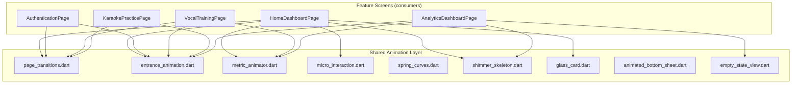

# Design Document: Modern UI Polish

## Overview

This design defines the architecture and implementation approach for a visual/animation polish pass across the Cockatiel vocal coaching Flutter app. The scope is purely presentational — no new screens, features, or backend changes. The goal is to elevate the app from functional to thesis-defense-ready by introducing cohesive page transitions, micro-interaction feedback, shimmer loading states, staggered entrance animations, animated metrics, glassmorphism accents, polished bottom sheets, and empty state animations.

All new components are reusable shared widgets placed in `lib/shared/animations/` and `lib/shared/widgets/`. They integrate with existing screens through composition (wrapping existing widgets) rather than rewriting screen logic. The existing `ChangeNotifier` state management and `MaterialPageRoute`-based routing are preserved — transitions are applied via custom `PageRouteBuilder` factories.

### Design Decisions

| Decision | Choice | Rationale |
|----------|--------|-----------|
| Animation library | Flutter built-in (`AnimationController`, `AnimatedBuilder`, `Hero`) | Zero additional dependency weight; full control over curves and timing |
| Shimmer | `shimmer: ^3.0.0` package | Well-maintained, lightweight, avoids reinventing gradient sweep logic |
| Empty state illustrations | `lottie: ^3.1.0` | Small file-size JSON animations; no raster assets needed |
| Shared location | `lib/shared/animations/` (new) + `lib/shared/widgets/` | Separates animation utilities from static widgets per project conventions |
| Page transitions | `PageRouteBuilder` factory functions | Drop-in replacement for `MaterialPageRoute` at call sites; no router rewrite needed |
| Performance target | 60fps on mid-range Android (Snapdragon 600-series) | Backdrop blur limited to ≤3 elements/screen; stagger counts capped |

## Architecture

```
lib/shared/
├── animations/
│   ├── page_transitions.dart        # PageRouteBuilder factories
│   ├── entrance_animation.dart      # Staggered entrance controller widget
│   ├── metric_animator.dart          # Count-up and ring-fill widgets
│   ├── micro_interaction.dart        # Pressable scale wrapper
│   └── spring_curves.dart            # Custom spring simulation curves
├── widgets/
│   ├── shimmer_skeleton.dart         # Shimmer loading skeleton widget
│   ├── glass_card.dart               # Glassmorphism card widget
│   ├── animated_bottom_sheet.dart    # Spring-damped bottom sheet presenter
│   ├── empty_state_view.dart         # Animated empty state widget
│   └── animated_score_display.dart   # Score with count-up + pulse
```

### Integration Architecture (Mermaid)



### Dependency Direction

```
Feature pages → shared/animations/ + shared/widgets/
shared/animations/ → Flutter framework only (+ spring_curves.dart internally)
shared/widgets/ → Flutter framework + shimmer package + lottie package
```

No circular dependencies. No cross-feature imports. Animation widgets are stateless or self-managing (own `AnimationController` lifecycle via `SingleTickerProviderStateMixin` or `TickerProviderStateMixin`).

## Components and Interfaces

### 1. Page Transition Factories (`page_transitions.dart`)

```dart
/// Slide-right + fade-in for forward navigation.
PageRouteBuilder<T> slideForwardRoute<T>({
  required WidgetBuilder builder,
  Duration duration = const Duration(milliseconds: 400),
  String? heroTag,
});

/// Slide-left + fade-out for backward navigation.
PageRouteBuilder<T> slideBackRoute<T>({
  required WidgetBuilder builder,
  Duration duration = const Duration(milliseconds: 350),
});

/// Cross-fade for tab switches.
PageRouteBuilder<T> crossFadeRoute<T>({
  required WidgetBuilder builder,
  Duration duration = const Duration(milliseconds: 250),
});

/// Scale-up + fade for auth → dashboard welcome moment.
PageRouteBuilder<T> scaleWelcomeRoute<T>({
  required WidgetBuilder builder,
  Duration duration = const Duration(milliseconds: 500),
});

/// Vertical slide-up for session flow transitions (briefing → live).
PageRouteBuilder<T> slideUpRoute<T>({
  required WidgetBuilder builder,
  Duration duration = const Duration(milliseconds: 450),
});

/// Scale-down existing + fade-in results overlay.
PageRouteBuilder<T> resultRevealRoute<T>({
  required WidgetBuilder builder,
  Duration duration = const Duration(milliseconds: 500),
});
```

All factories internally use `Curves.easeOutCubic` for enter and `Curves.easeInCubic` for exit. Hero animations use the default Flutter `Hero` widget — the transition factories set `transitionDuration` to allow hero flight completion.

### 2. Staggered Entrance Animation (`entrance_animation.dart`)

```dart
/// Wraps a list of children with staggered fade+slide entrance.
/// Only animates on first build (tracks via internal flag).
class StaggeredEntrance extends StatefulWidget {
  const StaggeredEntrance({
    super.key,
    required this.children,
    this.staggerDelay = const Duration(milliseconds: 60),
    this.itemDuration = const Duration(milliseconds: 400),
    this.slideOffset = 24.0,
    this.curve = Curves.easeOutCubic,
  });

  final List<Widget> children;
  final Duration staggerDelay;
  final Duration itemDuration;
  final double slideOffset;
  final Curve curve;
}
```

Implementation uses a single `AnimationController` driving staggered `Interval`s. Each child is wrapped in `FadeTransition` + `SlideTransition`. The widget records a static `Set<Key>` (keyed by page route name) to skip re-animation on rebuilds.

### 3. Micro-Interaction Wrapper (`micro_interaction.dart`)

```dart
/// Wraps any child with press-scale feedback.
class Pressable extends StatefulWidget {
  const Pressable({
    super.key,
    required this.child,
    required this.onTap,
    this.scaleDown = 0.96,
    this.pressDuration = const Duration(milliseconds: 100),
    this.releaseDuration = const Duration(milliseconds: 200),
  });

  final Widget child;
  final VoidCallback onTap;
  final double scaleDown;
  final Duration pressDuration;
  final Duration releaseDuration;
}
```

Uses `GestureDetector` with `onTapDown`/`onTapUp`/`onTapCancel` to drive a `ScaleTransition`. For cards, expose `PressableCard` variant that also elevates on press.

### 4. Shimmer Skeleton (`shimmer_skeleton.dart`)

```dart
/// Displays a shimmer placeholder matching the given layout shape.
class ShimmerSkeleton extends StatelessWidget {
  const ShimmerSkeleton({
    super.key,
    required this.child,
    this.baseColor,
    this.highlightColor,
    this.period = const Duration(milliseconds: 1200),
  });

  /// The "shape" widget (Container with rounded rect, sized to match real content).
  final Widget child;
  final Color? baseColor;
  final Color? highlightColor;
  final Duration period;
}

/// Pre-built skeleton shapes for common layouts.
class SkeletonShapes {
  static Widget dashboardCard({required ThemeData theme});
  static Widget listItem({required ThemeData theme});
  static Widget chartBlock({required ThemeData theme});
  static Widget statRow({required ThemeData theme});
}
```

Uses the `shimmer` package internally. Colors default to `theme.colorScheme.surface` at 100% transitioning through 40% opacity. Fade-out on content arrival is handled by wrapping in `AnimatedSwitcher` with 200ms duration at the call site.

### 5. Metric Animator (`metric_animator.dart`)

```dart
/// Animates a numeric value from 0 to [value] with count-up interpolation.
class CountUpText extends StatefulWidget {
  const CountUpText({
    super.key,
    required this.value,
    this.duration = const Duration(milliseconds: 800),
    this.curve = Curves.easeOutCubic,
    this.style,
    this.suffix = '',
    this.decimalPlaces = 0,
  });

  final double value;
  final Duration duration;
  final Curve curve;
  final TextStyle? style;
  final String suffix;
  final int decimalPlaces;
}

/// Animates a circular progress ring from 0 to [progress].
class AnimatedProgressRing extends StatefulWidget {
  const AnimatedProgressRing({
    super.key,
    required this.progress,
    this.duration = const Duration(milliseconds: 1000),
    this.curve = Curves.easeOutCubic,
    this.strokeWidth = 8.0,
    this.size = 80.0,
    this.color,
    this.backgroundColor,
  });

  final double progress; // 0.0 – 1.0
  final Duration duration;
  final Curve curve;
  final double strokeWidth;
  final double size;
  final Color? color;
  final Color? backgroundColor;
}

/// Score display with count-up + pulse on completion.
class AnimatedScoreDisplay extends StatefulWidget {
  const AnimatedScoreDisplay({
    super.key,
    required this.score,
    this.isPersonalBest = false,
    this.countUpDuration = const Duration(milliseconds: 800),
    this.pulseDuration = const Duration(milliseconds: 300),
    this.glowDuration = const Duration(milliseconds: 600),
  });

  final int score;
  final bool isPersonalBest;
  final Duration countUpDuration;
  final Duration pulseDuration;
  final Duration glowDuration;
}
```

`AnimatedScoreDisplay` chains two animations: count-up completes → triggers pulse (1.0→1.08→1.0) via a second controller. If `isPersonalBest` is true, a gold (#E1B261) glow `DecoratedBox` with `BoxShadow` fades in over `glowDuration`.

### 6. Glass Card (`glass_card.dart`)

```dart
/// Frosted-glass card with backdrop blur and translucent fill.
class GlassCard extends StatelessWidget {
  const GlassCard({
    super.key,
    required this.child,
    this.blurSigma = 12.0,
    this.fillColor,
    this.borderRadius = 24.0,
    this.borderOpacity = 0.3,
  });

  final Widget child;
  final double blurSigma;
  final Color? fillColor; // defaults to white at 70% opacity
  final double borderRadius;
  final double borderOpacity;
}
```

Uses `ClipRRect` + `BackdropFilter` with `ImageFilter.blur`. Dark variant for live session overlay uses `fillColor: Colors.black.withOpacity(0.4)` and `blurSigma: 16`. Performance constraint: max 3 `GlassCard` instances per visible screen.

### 7. Animated Bottom Sheet (`animated_bottom_sheet.dart`)

```dart
/// Shows a spring-animated bottom sheet.
Future<T?> showAnimatedBottomSheet<T>(
  BuildContext context, {
  required WidgetBuilder builder,
  double dampingRatio = 0.85,
  Duration duration = const Duration(milliseconds: 400),
  bool isDismissible = true,
  Color barrierColor = const Color(0x66000000),
});

/// Shows a scale+fade confirmation dialog.
Future<T?> showAnimatedDialog<T>(
  BuildContext context, {
  required WidgetBuilder builder,
  Duration duration = const Duration(milliseconds: 200),
});
```

Bottom sheet uses `showModalBottomSheet` with a custom `AnimationController` and `SpringSimulation` (damping 0.85). The scrim fades in over 250ms concurrently.

### 8. Empty State View (`empty_state_view.dart`)

```dart
/// Animated empty state with illustration, headline, body, and CTA.
class EmptyStateView extends StatelessWidget {
  const EmptyStateView({
    super.key,
    required this.headline,
    required this.body,
    this.lottieAsset,
    this.customAnimation,
    this.ctaLabel,
    this.onCtaTap,
    this.illustrationSize = 200.0,
    this.ctaPulseInterval = const Duration(milliseconds: 3000),
  });

  final String headline;
  final String body;
  final String? lottieAsset; // path to assets/animations/*.json
  final Widget? customAnimation;
  final String? ctaLabel;
  final VoidCallback? onCtaTap;
  final double illustrationSize;
  final Duration ctaPulseInterval;
}
```

When `lottieAsset` is provided, renders via `Lottie.asset()` with `repeat: true` at the specified size (max 200×200). CTA button pulses (scale 1.0→1.04→1.0) on the `ctaPulseInterval` cadence using a repeating `AnimationController`.

### 9. Spring Curves (`spring_curves.dart`)

```dart
/// Custom spring simulation for natural-feeling bottom sheets and modals.
class SpringCurve extends Curve {
  const SpringCurve({
    this.damping = 0.85,
    this.stiffness = 200.0,
  });

  final double damping;
  final double stiffness;

  @override
  double transformInternal(double t) { /* spring math */ }
}
```

## Data Models

This feature introduces no new domain models or DTOs. All components are purely presentational and consume existing data through their widget constructors. The only "data" flowing through the animation layer is:

- `double progress` — 0.0–1.0 for ring fills
- `int/double value` — numeric scores for count-up
- `bool isPersonalBest` — drives gold glow accent
- `Duration` / `Curve` configuration — animation timing

No serialization, persistence, or API interaction.

## Correctness Properties

N/A — Property-based testing is not applicable to this feature. This spec covers UI rendering, visual transitions, and motion design. None of the acceptance criteria involve pure functions with input/output behavior or universal properties testable across a wide input space. The correctness of animations is inherently visual (smooth motion, correct duration, proper easing) and is verified through widget tests with `tester.pump()` timing assertions and manual visual QA on physical devices. See Testing Strategy for the alternative approach.

## Error Handling

| Scenario | Handling |
|----------|----------|
| Shimmer displayed but content never arrives (network timeout) | Existing error handling in feature pages shows retry UI; shimmer fades out when loading state changes to error |
| Lottie asset missing or corrupt | `EmptyStateView` falls back to a static `Icon` + text layout via `errorBuilder` |
| AnimationController used after dispose | All controllers created in `initState` and disposed in `dispose()`; `mounted` check before `setState` |
| Backdrop blur too expensive on low-end device | Cap `GlassCard` to 3 per screen; sigma values kept ≤16; provide `GlassCard.disabled` constructor that renders a flat opaque card when needed |
| Stagger animation on very long lists (50+ items) | Cap visible stagger to first 10 items; remaining appear instantly to avoid multi-second entrance delays |

## Testing Strategy

### Approach

This feature is **purely visual/animation** — UI rendering, motion timing, and visual appearance. Property-based testing is **not applicable** because:

- There are no pure functions with input/output behavior to test
- There are no universal properties that hold across a wide input space
- The "correctness" of animations is visual (smooth motion, correct duration) rather than logical
- Widget tests with `tester.pump()` and `tester.pumpAndSettle()` are the standard Flutter approach for verifying animation behavior

### Widget Tests (primary)

Each shared animation widget gets a dedicated widget test file:

| Widget | Test Focus |
|--------|-----------|
| `Pressable` | Verify scale transform changes on tap down/up; verify `onTap` callback fires |
| `StaggeredEntrance` | Verify children are invisible at t=0, partially visible mid-animation, fully visible after settle; verify no re-animation on rebuild |
| `CountUpText` | Verify text shows "0" initially, intermediate value mid-pump, final value after duration |
| `AnimatedProgressRing` | Verify ring progress at 0 initially, target value after settle |
| `AnimatedScoreDisplay` | Verify count-up completes then pulse scale occurs; verify gold glow when `isPersonalBest=true` |
| `ShimmerSkeleton` | Verify shimmer animation is running (opacity cycling); verify shape renders |
| `GlassCard` | Verify `BackdropFilter` is present in widget tree; verify border radius matches config |
| `EmptyStateView` | Verify headline/body text renders; verify Lottie fallback when asset missing; verify CTA button renders when provided |
| `showAnimatedBottomSheet` | Verify sheet appears on call; verify dismiss behavior |

### Test Structure

```
test/
├── shared/
│   ├── animations/
│   │   ├── entrance_animation_test.dart
│   │   ├── metric_animator_test.dart
│   │   ├── micro_interaction_test.dart
│   │   └── page_transitions_test.dart
│   └── widgets/
│       ├── shimmer_skeleton_test.dart
│       ├── glass_card_test.dart
│       ├── animated_bottom_sheet_test.dart
│       └── empty_state_view_test.dart
```

### Integration Verification

- Manual visual QA on physical Android device (mid-range: Pixel 4a or equivalent)
- Flutter DevTools performance overlay to confirm 60fps during transitions
- `dart analyze` must pass with zero issues
- `flutter build apk --debug` must succeed

### Performance Profiling Checklist

- [ ] Page transitions: no frame drops on forward/back navigation
- [ ] Staggered entrance: ≤10 concurrent animations (cap long lists)
- [ ] Shimmer: single gradient sweep (not per-item shaders)
- [ ] Backdrop blur: verify GPU rasterization time stays under 8ms/frame
- [ ] Lottie: verify JSON animation files are ≤50KB each

## Dependencies

Add to `pubspec.yaml`:

```yaml
dependencies:
  shimmer: ^3.0.0        # Shimmer loading effect
  lottie: ^3.1.0         # Lottie JSON animations for empty states
```

Both packages are well-maintained, widely used in the Flutter ecosystem, and add minimal binary size. No new dev dependencies required — existing `flutter_test` SDK is sufficient for widget tests.
