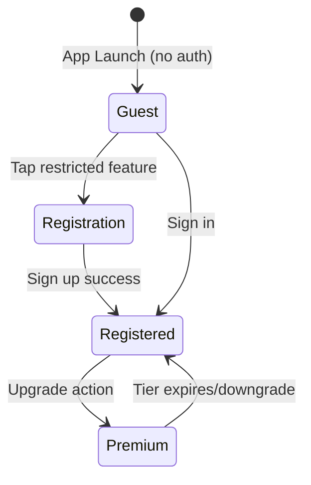
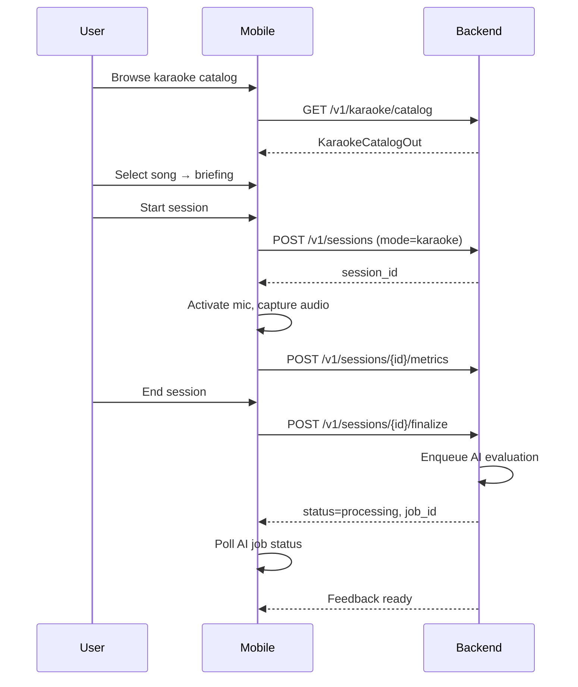

# Design Document: Thesis Alignment Comprehensive

## Overview

This design aligns the Cockatiel Enhanced vocal coaching platform with its thesis deliverables by implementing new subsystems (Guest Access, Premium Tier, Karaoke Song Catalog), enhancing existing modules (Profile, Dashboard, Karaoke), verifying completeness of delivered features (Voice Room, Coaching, Progress Tracking, AI Engine), and enforcing scope constraints (Sprint 11 removal, Android-only, ISO 25010).

The system follows a two-layer architecture:
- **Backend**: Python 3.11+ FastAPI with Pydantic v2 validation, Ollama-based AI feedback, in-memory queue for async evaluation, and repository-pattern persistence (memory/Firestore).
- **Mobile**: Flutter/Dart targeting Android, Firebase Auth, ChangeNotifier state management, and feature-based clean architecture.

### Design Decisions

| Decision | Rationale |
|----------|-----------|
| Guest mode via local state (no backend session) | Guests browse catalog without auth tokens; minimizes backend complexity |
| Premium tier stored in user profile document | Single source of truth; backend resolves privileges at request time |
| Karaoke catalog as backend module (like training catalog) | Backend-driven allows content updates without app releases |
| Priority queue via tier-aware dequeue ordering | Reuses existing in-memory queue with sort key modification |
| Vocal preferences as profile sub-document | Avoids separate collection; preferences are always fetched with profile |
| Sprint 11 exclusion via catalog filtering | No code deletion needed; catalog just doesn't include diction exercises |

---

## Architecture

```mermaid
graph TB
  subgraph Mobile["Mobile (Flutter/Android)"]
    Auth["Authentication Feature"]
    Dashboard["Home Dashboard"]
    VocalTraining["Vocal Training Feature"]
    Karaoke["Karaoke Feature"]
    Analytics["Analytics Dashboard"]
    Profile["User Profile Feature"]
    AppState["AppState (ChangeNotifier)"]
    ApiClient["API Client"]
  end

  subgraph Backend["Backend (FastAPI)"]
    Router["API Router v1"]
    AuthEndpoint["Auth Endpoints"]
    SessionEndpoint["Session Endpoints"]
    TrainingEndpoint["Training Endpoints"]
    KaraokeEndpoint["Karaoke Endpoints (new)"]
    AnalyticsEndpoint["Analytics Endpoints"]
    ProfileEndpoint["Profile Endpoints (new)"]

    SessionService["Session Service"]
    TrainingService["Training Service"]
    KaraokeService["Karaoke Service (new)"]
    AnalyticsService["Analytics Service"]
    ProfileService["Profile Service (new)"]

    AIOrchestrator["AI Orchestrator"]
    AIQueue["AI Evaluation Queue"]
    AIWorker["AI Worker"]

    SessionRepo["Session Repository"]
    UserRepo["User Repository"]
  end

  subgraph External["External"]
    Firebase["Firebase Auth"]
    Ollama["Ollama LLM"]
  end

  Mobile -->|HTTP + Bearer Token| Backend
  Auth --> Firebase
  AuthEndpoint --> Firebase
  AIOrchestrator --> Ollama
  AIQueue --> AIWorker --> AIOrchestrator
  SessionEndpoint --> SessionService --> SessionRepo
  KaraokeEndpoint --> KaraokeService
  ProfileEndpoint --> ProfileService --> UserRepo
```



### Access Tier Flow



### Karaoke Session Flow



---

## Components and Interfaces

### Backend Components

#### 1. Profile Service (new: `app/modules/users/service.py`)

```python
def get_user_profile(user_id: str) -> dict[str, Any]: ...
def update_vocal_preferences(user_id: str, preferences: VocalPreferencesIn) -> dict[str, Any]: ...
def upgrade_to_premium(user_id: str) -> dict[str, Any]: ...
def get_access_tier(user_id: str) -> str: ...  # "guest" | "registered" | "premium"
```

#### 2. Karaoke Catalog Service (new: `app/modules/karaoke/service.py`)

```python
def get_karaoke_catalog() -> dict[str, Any]: ...
def get_song_by_id(song_id: str) -> dict[str, Any] | None: ...
def list_songs_by_category(category: str) -> list[dict[str, Any]]: ...
```

#### 3. Karaoke Catalog Data (new: `app/modules/karaoke/catalog.py`)

Static catalog definition following the same pattern as `training/catalog.py`.

#### 4. Profile Endpoint (new: `app/api/v1/endpoints/profile.py`)

| Method | Path | Description |
|--------|------|-------------|
| GET | `/v1/profile` | Get full user profile with preferences |
| PATCH | `/v1/profile/preferences` | Update vocal preferences |
| POST | `/v1/profile/upgrade` | Upgrade to premium tier |

#### 5. Karaoke Endpoint (new: `app/api/v1/endpoints/karaoke.py`)

| Method | Path | Description |
|--------|------|-------------|
| GET | `/v1/karaoke/catalog` | Get full karaoke song catalog |
| GET | `/v1/karaoke/catalog/{song_id}` | Get single song detail |

#### 6. AI Queue Enhancement (modify: `app/queue/tasks/ai_evaluation_queue.py`)

Add `priority` field to queue items. Premium users get `priority=1`, registered users get `priority=2`. Dequeue selects lowest priority first (FIFO within same priority).

#### 7. Guest Access Guard (middleware pattern)

Guest access doesn't require new middleware — endpoints already require auth tokens. The mobile app gates access locally by checking `AppState.isAuthenticated`. The training catalog endpoint gets an optional `?guest=true` parameter that returns catalog metadata without session-creation capability.

### Mobile Components

#### 1. Guest Mode State (enhance: `core/state/app_state.dart`)

```dart
bool get isGuest => !isAuthenticated;
AccessTier get accessTier => _currentUser?.accessTier ?? AccessTier.guest;
```

#### 2. Karaoke Catalog Page (new: `features/karaoke_practice/presentation/`)

- `karaoke_catalog_page.dart` — browsable song list fetched from backend
- `karaoke_song_briefing_page.dart` — pre-session song detail with tips
- Update existing `karaoke_practice_page.dart` to route through catalog

#### 3. Profile Management Page (enhance: `features/user_profile/presentation/`)

- `vocal_preferences_page.dart` — form for vocal range, categories, training goal
- Update `user_profile_page.dart` to display preferences and link to edit

#### 4. Dashboard Enhancement (enhance: `features/home_dashboard/presentation/`)

- Add recent evaluations section (last 3 sessions)
- Add progress summary card (streak, avg score, total sessions)
- Add personalized recommendation card

#### 5. Karaoke Models (new: `shared/models/karaoke_models.dart`)

DTOs for karaoke catalog, song entries, category metadata.

#### 6. API Client Extensions (modify: `core/network/api_client.dart`)

```dart
Future<KaraokeCatalog> fetchKaraokeCatalog();
Future<KaraokeSong> fetchKaraokeSong({required String songId});
Future<UserProfileFull> fetchFullProfile();
Future<UserProfileFull> updateVocalPreferences(VocalPreferencesUpdate prefs);
```

---

## Data Models

### Backend Schemas (Pydantic v2)

```python
# --- Access Tier ---
AccessTier = Literal["guest", "registered", "premium"]

VocalRange = Literal["soprano", "mezzo-soprano", "alto", "tenor", "baritone", "bass"]

TrainingGoal = Literal[
  "pitch_improvement", "breath_control", "tone_quality",
  "range_extension", "general_skill_building"
]

# --- Profile ---
class VocalPreferencesIn(BaseModel):
  model_config = ConfigDict(extra="forbid")
  vocal_range: VocalRange
  preferred_categories: list[str] = Field(min_length=1, max_length=3)
  training_goal: TrainingGoal

class VocalPreferencesOut(BaseModel):
  vocal_range: VocalRange
  preferred_categories: list[str]
  training_goal: TrainingGoal

class UserProfileOut(BaseModel):
  uid: str
  email: str
  name: str
  access_tier: AccessTier
  vocal_preferences: VocalPreferencesOut | None = None
  premium_expires_at: int | None = Field(default=None, ge=0)

# --- Karaoke Catalog ---
KaraokeDifficulty = Literal["beginner", "intermediate", "advanced"]

class KaraokeSongOut(BaseModel):
  song_id: str
  title: str
  style_category: str
  difficulty: KaraokeDifficulty
  duration_sec: int = Field(ge=30, le=180)
  artist_reference: str
  tempo_bpm: int = Field(ge=40, le=220)
  vocal_range_low: str
  vocal_range_high: str
  objective: str
  performance_tips: list[str] = Field(min_length=1)

class KaraokeCategoryOut(BaseModel):
  category_id: str
  style_label: str
  description: str
  songs: list[KaraokeSongOut]

class KaraokeCatalogOut(BaseModel):
  module_id: str
  title: str
  description: str
  categories: list[KaraokeCategoryOut] = Field(min_length=3)

# --- AI Queue Enhancement ---
class AIQueueItem(BaseModel):
  job_id: str
  session_id: str
  user_id: str
  priority: int = Field(ge=1, le=2)  # 1=premium, 2=registered
  queued_at: int = Field(ge=0)
  state: Literal["queued", "processing", "completed", "failed"]
```

### Mobile DTOs (Dart)

```dart
enum AccessTier { guest, registered, premium }

enum VocalRange { soprano, mezzoSoprano, alto, tenor, baritone, bass }

enum TrainingGoal {
  pitchImprovement, breathControl, toneQuality,
  rangeExtension, generalSkillBuilding
}

class VocalPreferences {
  final VocalRange vocalRange;
  final List<String> preferredCategories;
  final TrainingGoal trainingGoal;
}

class UserProfileFull {
  final String uid;
  final String email;
  final String name;
  final AccessTier accessTier;
  final VocalPreferences? vocalPreferences;
  final int? premiumExpiresAt;
}

class KaraokeSong {
  final String songId;
  final String title;
  final String styleCategory;
  final String difficulty;
  final int durationSec;
  final String artistReference;
  final int tempoBpm;
  final String vocalRangeLow;
  final String vocalRangeHigh;
  final String objective;
  final List<String> performanceTips;
}

class KaraokeCategory {
  final String categoryId;
  final String styleLabel;
  final String description;
  final List<KaraokeSong> songs;
}

class KaraokeCatalog {
  final String moduleId;
  final String title;
  final String description;
  final List<KaraokeCategory> categories;
}
```

### User Repository Document Structure

```json
{
  "uid": "firebase-uid",
  "email": "user@example.com",
  "name": "Display Name",
  "access_tier": "registered",
  "vocal_preferences": {
    "vocal_range": "tenor",
    "preferred_categories": ["vocal_training", "do_re_mi"],
    "training_goal": "pitch_improvement"
  },
  "premium_expires_at": null,
  "created_at": 1710000000000,
  "updated_at": 1710000000000
}
```

---

## Correctness Properties

*A property is a characteristic or behavior that should hold true across all valid executions of a system—essentially, a formal statement about what the system should do. Properties serve as the bridge between human-readable specifications and machine-verifiable correctness guarantees.*

### Property 1: Guest Access Control Gate

*For any* feature access attempt in guest mode, the system should allow access to catalog browsing (category list, exercise names, descriptions, difficulty, objectives) and deny access to session creation, progress storage, and AI feedback. Additionally, tapping any restricted feature should produce a navigation event to the registration flow with a message containing the name of the restricted feature.

**Validates: Requirements 1.1, 1.4**

### Property 2: Premium Queue Priority Ordering

*For any* evaluation queue containing a mix of Premium and Registered user requests, all Premium requests should be dequeued before any Registered user request that was submitted after them, while maintaining FIFO ordering within the same priority tier.

**Validates: Requirements 2.4**

### Property 3: Tier-Based Session Retention Policy

*For any* user, the session retention window should be 365 days when their tier is Premium, and 90 days when their tier is Registered. If a user downgrades from Premium, sessions accumulated during the Premium period are retained, but new sessions follow the 90-day retention window.

**Validates: Requirements 2.3, 2.7**

### Property 4: Vocal Preferences Validation Round-Trip

*For any* VocalPreferencesIn payload, if vocal_range is one of the six allowed classifications, preferred_categories contains 1–3 values from the Training_Catalog categories, and training_goal is one of the five allowed values, then the update should succeed and fetching the profile should return those exact preferences. For any payload that violates these constraints, the update should be rejected and existing preferences should remain unchanged.

**Validates: Requirements 3.2, 3.3, 3.4**

### Property 5: Preference-Based Recommendation Filtering

*For any* user with vocal preferences set, all recommended exercises returned by the Coaching_Module should belong to the user's preferred categories and be appropriate for their vocal range classification.

**Validates: Requirements 3.6**

### Property 6: Dashboard Recent Sessions Ordering

*For any* set of completed sessions, the dashboard should display exactly the 3 sessions with the most recent completion timestamps, ordered from newest to oldest.

**Validates: Requirements 4.2**

### Property 7: Voice Room Attempt Limit Invariant

*For any* session with a configured maximum attempts value, the system should allow exactly that many attempts and reject further retry requests once the limit is reached.

**Validates: Requirements 5.4**

### Property 8: Feedback Payload Structural Integrity

*For any* generated Feedback_Payload, it must contain: an overall_score between 0 and 100, a strengths list with at most 3 items, an improvements list with at most 3 items, a next_exercises list with at most 2 items, a non-empty model_identifier, and a non-empty prompt_version. For karaoke sessions, the feedback must additionally cover pitch accuracy, timing, and breath control.

**Validates: Requirements 5.5, 7.4, 12.1, 12.4**

### Property 9: Exercise Metadata Completeness

*For any* exercise in any training catalog category, it must have all required metadata fields present and non-empty: name, description, objective, difficulty level (one of beginner/intermediate/advanced), and microphone requirements.

**Validates: Requirements 6.2**

### Property 10: AI Evaluation Uses Best Attempt

*For any* training session with multiple attempts having different metric scores, the AI evaluation should reference the best attempt's metrics rather than the last or average attempt.

**Validates: Requirements 12.5**

### Property 11: Karaoke Catalog Integrity

*For any* karaoke catalog, it must contain a minimum of three categories with distinct style labels (no two categories share the same style_label), and each category must contain at least one song.

**Validates: Requirements 7.1, 13.1**

### Property 12: Metric Scores Bounded

*For any* captured vocal metric during a session (pitch accuracy, timing accuracy, breath control, pitch stability, note transition smoothness), the score value must be an integer between 0 and 100 inclusive.

**Validates: Requirements 7.3**

### Property 13: Song Metadata Validity

*For any* song in the karaoke catalog, it must have: a non-empty title, a style_category, a difficulty level (one of beginner/intermediate/advanced), a duration_sec between 30 and 180, a tempo_bpm between 40 and 220, and non-empty vocal_range_low and vocal_range_high values.

**Validates: Requirements 7.6, 13.2**

### Property 14: Training Catalog Scope Constraint

*For any* exercise in the Training_Catalog, its category must be one of the three thesis-documented categories: Vocal Training, Do Re Mi Pitch, or Breathing Exercises. No diction, pronunciation, or phrase clarity exercises may exist in the catalog.

**Validates: Requirements 9.1, 9.4**

### Property 15: API Input Validation Enforcement

*For any* API request containing fields that violate Pydantic schema constraints (out-of-range values, unexpected fields, missing required fields), the system should reject the request with a 422 status code and return descriptive field-level error messages.

**Validates: Requirements 10.3**

### Property 16: Authentication Enforcement

*For any* protected API endpoint, a request without a valid Firebase Auth token should receive a 401 Unauthorized response and no access to user data or operations.

**Validates: Requirements 10.4**

### Property 17: AI Evaluates All Five Dimensions

*For any* AI evaluation of vocal performance, the result must contain assessments for all five dimensions: pitch accuracy, timing accuracy, breath control, pitch stability, and note transition smoothness.

**Validates: Requirements 12.2**

### Property 18: Song Briefing Completeness

*For any* song selected from the karaoke catalog, the briefing screen must display: song title, style category, difficulty level, estimated duration, a textual objective description, and at least one performance tip relevant to the song's focus area.

**Validates: Requirements 13.4**

---

## Error Handling

### Backend Error Strategy

All backend errors are surfaced through the centralized `ApiError` exception and global exception handler, producing a standard error envelope:

```json
{
  "error": {
    "code": "DOMAIN_SPECIFIC_CODE",
    "message": "Human-readable description",
    "details": {},
    "trace_id": "uuid-v4"
  }
}
```

#### Domain Error Codes

| Code | HTTP Status | Context |
|------|-------------|---------|
| `AUTH_TOKEN_INVALID` | 401 | Firebase token validation failed |
| `AUTH_TOKEN_EXPIRED` | 401 | Token expired, client must refresh |
| `ACCESS_TIER_INSUFFICIENT` | 403 | User tier lacks permission for the requested resource |
| `SESSION_NOT_FOUND` | 404 | Session ID does not exist or belongs to another user |
| `SONG_NOT_FOUND` | 404 | Karaoke song_id not in catalog |
| `PROFILE_NOT_FOUND` | 404 | User profile document does not exist |
| `VALIDATION_ERROR` | 422 | Pydantic schema validation failure (field-level details included) |
| `PREFERENCES_INVALID` | 422 | Vocal preferences contain invalid values |
| `MAX_ATTEMPTS_REACHED` | 409 | Session attempt limit exceeded |
| `UPGRADE_FAILED` | 500 | Premium tier persistence failed; user retains existing tier |
| `AI_MODEL_UNREACHABLE` | 503 | All AI models timed out; fallback to rule-based scoring |
| `AI_EVALUATION_FAILED` | 500 | AI evaluation failed after retries; session marked as "failed" |
| `CATALOG_UNAVAILABLE` | 503 | Training or karaoke catalog could not be loaded |
| `MIC_PERMISSION_DENIED` | 400 | Client reports microphone permission unavailable |

#### Backend Error Handling Rules

1. **Never expose internal stack traces** — all exceptions pass through the global handler.
2. **Attach `trace_id`** to every error response for support correlation.
3. **Log with context** — include `user_id`, `session_id`, and operation name but never log secrets or full request bodies.
4. **Background workers catch all exceptions** — log the error, increment failure counter, and continue processing the queue (never crash the worker loop).
5. **AI fallback cascade** — if Ollama models are unreachable, fall back to deterministic rule-based scoring and include `"fallback": true` in the response.
6. **Idempotent retries** — premium upgrade and session finalization are idempotent; retries do not create duplicate state.

### Mobile Error Strategy

#### Error Categories and Behavior

| Error Type | User-Facing Behavior |
|------------|---------------------|
| Network timeout / connection lost | Inline error message + "Retry" button; show cached data where available |
| 401 Unauthorized | Redirect to login screen; clear local auth state |
| 403 Forbidden (tier insufficient) | Show upgrade prompt explaining required tier |
| 422 Validation error | Display field-level error messages below respective form inputs |
| 404 Not found | Show "content unavailable" state with navigation back |
| 500/503 Server error | Generic "Something went wrong" with retry option |
| Microphone permission denied | Inline explanation of why mic is needed + "Open Settings" button; do NOT create session |
| AI feedback processing | Show "Analyzing your session..." polling state; on timeout, show "Feedback delayed" with option to check later |
| Catalog load failure | Error state with "Catalog temporarily unavailable" message + retry action |

#### Mobile Error Handling Rules

1. **Never show raw JSON, status codes, or stack traces** to users.
2. **Retry with exponential backoff** for transient network errors (max 3 attempts).
3. **Graceful degradation** — if analytics data fails to load, show dashboard with stale/cached data and a "refresh" indicator.
4. **Dispose resources on error** — cancel timers, close streams, and release mic on any session error.
5. **Auth errors are non-recoverable** — any 401 immediately clears state and navigates to login.
6. **Preserve user input** — form errors never clear the user's typed data.

---

## Testing Strategy

### Test Pyramid Overview

```
         ╱╲
        ╱  ╲       Smoke Tests (6) — Module accessibility, build verification
       ╱────╲
      ╱      ╲     Integration Tests (15-20) — Full endpoint flows, timing, cache
     ╱────────╲
    ╱          ╲    Property-Based Tests (18) — Universal invariants (100+ iterations)
   ╱────────────╲
  ╱              ╲   Unit Tests (60-80) — Service logic, schemas, scoring, DTOs
 ╱────────────────╲
```

### Unit Tests

**Backend (pytest)**:
- Schema validation: Pydantic model acceptance/rejection for all input schemas
- Service logic: Profile service, karaoke service, analytics aggregation, queue priority ordering
- AI prompt resolution: Correct template selection based on session mode and exercise context
- Scoring functions: Rule-based fallback scoring produces valid Feedback_Payload structure
- Catalog filtering: Training catalog excludes Sprint 11 categories; karaoke catalog enforces structural constraints

**Mobile (dart test)**:
- DTO deserialization: `fromJson` factories handle all valid field combinations
- State logic: `AppState` tier transitions, guest mode detection, preference storage
- Recommendation filtering: Exercise filters match user preferences correctly

### Integration Tests

**Backend (httpx.AsyncClient against test app)**:
- Full endpoint flows: profile CRUD, karaoke catalog retrieval, session lifecycle
- Auth enforcement: requests without tokens receive 401; invalid tier requests receive 403
- AI evaluation pipeline: session finalization → queue → worker → feedback generation (mocked Ollama)
- Error envelope format: all error responses match the standard `{"error": {...}}` structure with `trace_id`

**Mobile (flutter_test with mock API client)**:
- Screen flow tests: Guest → registration prompt → sign up → dashboard with data
- Catalog browsing: catalog load → category selection → song briefing → session start
- Error recovery: network failure → retry → success path

### Property-Based Tests

**Library**: Hypothesis (Python backend), fast_check (Dart mobile)

**Configuration**: Minimum 100 iterations per property, `max_examples=200` for critical paths

**Backend Properties** (mapped to Correctness Properties above):
- Property 1: Guest access gate (generate random feature IDs, verify allow/deny)
- Property 2: Queue priority ordering (generate random queue states, verify dequeue order)
- Property 3: Retention window calculation (generate random tier histories, verify retention days)
- Property 4: Vocal preferences validation round-trip (generate random payloads, verify accept/reject + persistence)
- Property 5: Recommendation filtering (generate random preference + catalog combos, verify filter correctness)
- Property 6: Dashboard recent sessions (generate random session lists, verify top-3 ordering)
- Property 7: Attempt limit invariant (generate random attempt sequences, verify limit enforcement)
- Property 8: Feedback payload structure (generate random metric inputs, verify output structure)
- Property 9: Exercise metadata completeness (generate random catalog entries, verify all fields present)
- Property 10: Best attempt selection (generate random multi-attempt sessions, verify best is selected)
- Property 11: Karaoke catalog integrity (generate random catalogs, verify category uniqueness and minimum counts)
- Property 12: Metric scores bounded (generate random scores, verify 0-100 range)
- Property 13: Song metadata validity (generate random songs, verify field constraints)
- Property 14: Catalog scope constraint (generate random exercises, verify category membership)
- Property 15: API input validation (generate random malformed payloads, verify 422 rejection)
- Property 16: Auth enforcement (generate random requests without tokens, verify 401)
- Property 17: Five-dimension evaluation (generate random evaluations, verify all 5 dimensions present)
- Property 18: Song briefing completeness (generate random song selections, verify briefing fields)

**Tagging Convention**: Each property test includes a comment:
```python
# Feature: thesis-alignment-comprehensive, Property 8: Feedback Payload Structural Integrity
```

### Smoke Tests

- All six thesis module endpoints respond with 200 on health check
- Android APK builds successfully (`flutter build apk --debug`)
- No Sprint 11 (diction/pronunciation) artifacts in compiled build
- Firebase Auth integration accepts valid test tokens
- Ollama health endpoint reachable in development environment
- Karaoke catalog returns non-empty response

### Test Execution

**Backend**:
```bash
python3 -m pytest tests/unit tests/integration -q
python3 -m pytest tests/property -q --hypothesis-seed=random
```

**Mobile**:
```bash
dart analyze
flutter test
flutter build apk --debug
```

### Coverage Targets

| Layer | Target |
|-------|--------|
| Backend unit | ≥85% line coverage on service and schema modules |
| Backend integration | All endpoint happy paths + primary error paths |
| Property tests | 100 iterations minimum, 200 for critical properties (4, 8, 15) |
| Mobile unit | ≥80% on domain and model layers |
| Mobile widget | Key flows (guest, catalog, session, profile) |


## Correctness Properties

*A property is a characteristic or behavior that should hold true across all valid executions of a system — essentially, a formal statement about what the system should do. Properties serve as the bridge between human-readable specifications and machine-verifiable correctness guarantees.*

### Property 1: Guest catalog access without session creation

*For any* valid training catalog state and any unauthenticated (guest) request, the catalog browse endpoint SHALL return catalog data successfully, AND any attempt to create a session SHALL be rejected with an authentication error.

**Validates: Requirements 1.1**

### Property 2: Guest restricted feature navigation message

*For any* restricted feature identifier (e.g., "voice_room", "progress", "ai_feedback"), when a guest user attempts to access it, the system SHALL produce a navigation intent containing that specific feature identifier in its user-facing message.

**Validates: Requirements 1.4**

### Property 3: Tier upgrade round-trip

*For any* registered user, calling the upgrade-to-premium operation SHALL result in the user's access tier being "premium" when subsequently queried.

**Validates: Requirements 2.2**

### Property 4: Priority queue ordering

*For any* sequence of AI evaluation jobs enqueued with mixed access tiers, dequeuing SHALL always select premium-tier jobs before registered-tier jobs that were submitted after them, while maintaining FIFO order within the same tier.

**Validates: Requirements 2.4**

### Property 5: Premium session retention window

*For any* completed session with a timestamp between 91 and 365 days ago, a premium user's history query SHALL include that session, while a registered user's history query SHALL exclude it.

**Validates: Requirements 2.3**

### Property 6: Downgrade preserves historical premium sessions

*For any* user who accumulated sessions during a premium period and is subsequently downgraded to registered, all sessions created during the premium period SHALL remain accessible regardless of their age.

**Validates: Requirements 2.7**

### Property 7: Vocal preference validation

*For any* vocal preference update payload, the system SHALL accept it if and only if: vocal_range is one of {soprano, mezzo-soprano, alto, tenor, baritone, bass}, preferred_categories has length 1–3 with each value being a valid catalog category_id, and training_goal is one of the five allowed values.

**Validates: Requirements 3.2, 3.5**

### Property 8: Vocal preference persistence round-trip

*For any* valid VocalPreferencesIn payload, updating preferences and then reading the profile SHALL return vocal_preferences with identical vocal_range, preferred_categories, and training_goal values.

**Validates: Requirements 3.3**

### Property 9: Invalid preferences preserve existing state

*For any* invalid vocal preference payload (violating range, category count, or goal constraints), the update operation SHALL reject the request AND a subsequent profile read SHALL return the previously stored preferences unchanged.

**Validates: Requirements 3.4**

### Property 10: Preference-filtered recommendations

*For any* user with vocal preferences set and any catalog state, all recommended exercises SHALL belong to one of the user's preferred_categories.

**Validates: Requirements 3.6**

### Property 11: Dashboard recent evaluations are the N most recent

*For any* user with at least 3 completed sessions, the dashboard's recent evaluations list SHALL contain exactly the 3 sessions with the most recent completion timestamps, ordered from newest to oldest.

**Validates: Requirements 4.2**

### Property 12: Maximum attempts enforcement

*For any* training session with max_attempts=N, the system SHALL accept attempts 1 through N and SHALL reject any attempt with index > N with an appropriate error code.

**Validates: Requirements 5.4**

### Property 13: AI feedback output constraints

*For any* valid metric summary and exercise type, the generated CoachingFeedback SHALL have: overall_score in [0, 100], len(strengths) in [1, 3], len(improvements) in [1, 3], len(next_exercises) in [1, 2], non-empty model_used, and non-empty prompt_version.

**Validates: Requirements 7.4, 12.1, 12.4**

### Property 14: AI fallback on unreachable model

*For any* valid metric summary, when all configured AI models are unreachable or disabled, generate_feedback SHALL still return a valid CoachingFeedback with model_used="fallback-rules".

**Validates: Requirements 12.3**

### Property 15: Best attempt metrics for multi-attempt evaluation

*For any* training session with N attempts (N > 1), the metric summary used for AI evaluation SHALL be derived from the attempt with the highest overall score.

**Validates: Requirements 12.5**

### Property 16: AI prompt includes exercise context

*For any* session with a non-empty exercise_type and category_id, the resolved AI prompt SHALL contain the exercise name and difficulty level.

**Validates: Requirements 6.7**

### Property 17: Training catalog contains only thesis-documented categories

*For any* exercise in the training catalog, its category_id SHALL be one of {"vocal_training", "do_re_mi", "breathing"} and SHALL NOT be related to diction, pronunciation, or phrase clarity.

**Validates: Requirements 9.1, 9.4**

### Property 18: Karaoke catalog structural validity

*For any* karaoke catalog returned by the system, it SHALL contain at least 3 categories, all category style_label values SHALL be distinct, and every category SHALL contain at least 1 song.

**Validates: Requirements 7.1, 13.1**

### Property 19: Karaoke song metadata validity

*For any* song in the karaoke catalog, it SHALL have: non-empty title, non-empty artist_reference, difficulty in {beginner, intermediate, advanced}, tempo_bpm in [40, 220], duration_sec in [30, 180], and non-empty vocal_range_low and vocal_range_high.

**Validates: Requirements 7.6, 13.2**

### Property 20: Karaoke briefing data completeness

*For any* song in the karaoke catalog, it SHALL provide: non-empty title, non-empty style_category, valid difficulty, duration_sec > 0, non-empty objective, and at least 1 performance tip.

**Validates: Requirements 13.4**

### Property 21: AI failure marks session failed and preserves metrics

*For any* session where AI feedback generation raises an exception, the session SHALL be marked with status="failed" and a non-empty failure_reason, while all previously submitted metrics and attempts SHALL remain intact and queryable.

**Validates: Requirements 7.7**

### Property 22: Input validation rejects malformed requests

*For any* API request containing field values outside their declared constraints (e.g., pitch_accuracy > 100, empty exercise_type, invalid enum value), the system SHALL return HTTP 422 with an error response containing field-level validation details.

**Validates: Requirements 10.3**

---

## Error Handling

### Backend Error Strategy

| Scenario | Error Code | HTTP Status | Recovery |
|----------|-----------|-------------|----------|
| Guest attempts session creation | `AUTH_REQUIRED` | 401 | Navigate to registration |
| Invalid vocal preferences | `VALIDATION_ERROR` | 422 | Return field-level errors |
| Premium upgrade persistence failure | `TIER_UPGRADE_FAILED` | 500 | Retain existing tier, allow retry |
| Karaoke catalog unavailable | `CATALOG_UNAVAILABLE` | 503 | Return error with retry-after header |
| AI model unreachable | (internal) | — | Fallback to deterministic rules |
| Max attempts exceeded | `MAX_ATTEMPTS_REACHED` | 409 | Inform user, show summary |
| Session not found | `SESSION_NOT_FOUND` | 404 | Navigate back |
| Invalid metric values | `VALIDATION_ERROR` | 422 | Reject batch, return details |

### Mobile Error Handling

- **Network errors**: Show inline error with retry button. Cache last successful catalog for offline browsing.
- **Auth errors (401)**: Redirect to login screen. Clear local state.
- **Validation errors (422)**: Display field-level feedback below form inputs.
- **Catalog load failure (guest or authenticated)**: Show error state with "Try Again" button and message: "Catalog temporarily unavailable."
- **AI processing timeout**: Continue polling; show "Still analyzing..." after 10 seconds.
- **Mic permission denied**: Block session start with inline explanation and settings link.

### Graceful Degradation

- If backend is unreachable, the mobile app shows cached dashboard data (if available) with a stale-data indicator.
- If AI queue is full, sessions still finalize successfully — feedback arrives asynchronously via polling.
- If karaoke catalog fails to load, display error state (never crash or show empty screen without explanation).

---

## Testing Strategy

### Testing Approach

This feature uses a **dual testing approach**:
- **Unit tests**: Verify specific examples, edge cases, integration points, and error conditions
- **Property-based tests**: Verify universal properties (correctness properties above) across randomized inputs

### Property-Based Testing Configuration

- **Library**: [Hypothesis](https://hypothesis.readthedocs.io/) for Python backend
- **Minimum iterations**: 100 per property test
- **Tag format**: `# Feature: thesis-alignment-comprehensive, Property {N}: {title}`
- Each correctness property maps to exactly one property-based test function

### Backend Tests

#### Property-Based Tests (Hypothesis)

| Property | Test Target | Generator Strategy |
|----------|------------|-------------------|
| P4: Priority queue | `ai_evaluation_queue` | Random sequences of (session_id, user_id, tier) tuples |
| P7: Vocal preference validation | `VocalPreferencesIn` schema | Random combinations of vocal_range, categories, goals |
| P8: Preference round-trip | Profile service | Valid VocalPreferencesIn instances |
| P9: Invalid preferences | Profile service | Deliberately invalid payloads (wrong range, 4+ categories) |
| P12: Max attempts | Session service | Random attempt sequences up to and beyond max |
| P13: Feedback constraints | AI orchestrator | Random valid metric summaries |
| P14: AI fallback | AI orchestrator (Ollama disabled) | Random metric summaries |
| P15: Best attempt selection | Session service | Sessions with 2-3 attempts at random scores |
| P17: Catalog categories | Training catalog | Enumerate all exercises, assert category membership |
| P18: Karaoke catalog structure | Karaoke catalog | Validate catalog invariants |
| P19: Karaoke song metadata | Karaoke catalog | Validate each song's fields |
| P21: AI failure → failed session | Session service + mock AI | Random sessions with simulated AI exceptions |
| P22: Input validation | Schema validation | Random invalid payloads |

#### Unit Tests (pytest)

- Profile service: CRUD operations, tier transitions, preference edge cases
- Karaoke catalog: static catalog integrity, song lookup by ID
- Karaoke service: catalog retrieval, category filtering
- Dashboard: recent evaluations selection, progress summary computation
- Queue priority: enqueue/dequeue ordering with mixed tiers
- Retention policy: session visibility by tier and age

#### Integration Tests (httpx)

- Guest access: GET catalog without auth token succeeds; POST session without token returns 401
- Profile endpoints: full CRUD flow with valid/invalid payloads
- Karaoke endpoints: catalog fetch, song detail, session creation + finalize
- Premium upgrade: tier change persists and affects queue priority
- Dashboard endpoint: returns recent evaluations and recommendations

### Mobile Tests

#### Widget Tests

- Guest mode: lock indicators visible, registration prompt present
- Dashboard: module cards rendered, recent evaluations section present
- Karaoke catalog: song cards rendered from mock data
- Karaoke briefing: all metadata fields displayed
- Profile: vocal preferences form validation
- Error states: retry buttons functional on catalog failure

#### Unit Tests

- Access tier resolution from profile data
- Karaoke model deserialization from JSON
- Vocal preference model validation
- Feature restriction logic (isGuest checks)

### Validation Commands

```bash
# Backend
python3 -m pytest tests/unit tests/integration -q

# Mobile
dart analyze
flutter build apk --debug
flutter test
```

### Test Coverage Goals

- All 22 correctness properties have corresponding property-based tests
- All error paths have at least one unit test
- All new endpoints have at least one integration test
- All new mobile screens have at least one widget test
- `dart analyze` produces zero issues
- `flutter build apk --debug` succeeds
